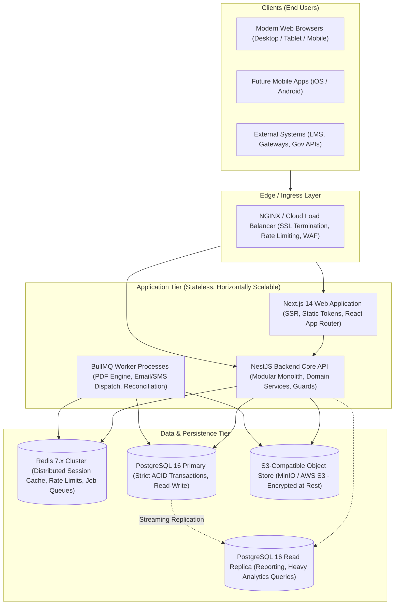

# System & Infrastructure Architecture
## Enterprise College Management System (CMS)

### 1. High-Level System Architecture (C4 Container Diagram)



---

### 2. Technology Stack Justification

| Layer | Chosen Technology | Rationale & Enterprise Fitness |
| :--- | :--- | :--- |
| **Frontend Framework** | **Next.js 14+ / React 18+ (TypeScript)** | Server-side rendering (SSR) for optimal initial load, atomic design system compatibility, robust accessibility (WCAG 2.1 AA), strong typing, and edge routing. |
| **Backend Framework** | **NestJS 10+ (Node.js 22 LTS, TypeScript)** | Highly structured modular architecture, enterprise dependency injection, built-in OpenAPI/Swagger generation, standard exception filters, validation pipes, and guard abstractions. |
| **Database** | **PostgreSQL 16+** | Industry standard relational engine with strict ACID compliance, robust foreign key and check constraints, high-precision `NUMERIC` types, JSONB for dynamic forms, and PgBouncer connection pooling. |
| **Caching & Job Queue** | **Redis 7+ & BullMQ** | Sub-millisecond latency for rate limiting and token blacklisting; robust distributed queuing with delayed jobs, dead-letter queues, and automatic retries for long-running workflows. |
| **Object Storage** | **S3-Compatible (MinIO / AWS S3)** | Secure, encrypted-at-rest document storage decoupled from compute nodes; pre-signed time-limited download URLs prevent direct public asset leakage. |
| **Containerization** | **Docker & Docker Compose (K8s Ready)** | Reproducible environments across local development, staging, and production; stateless container images allowing horizontal pod autoscaling. |

---

### 3. Scaling for 10,000+ to 50,000+ Concurrent Users

#### A. Peak Registration Window Concurrency (Traffic Surge Management)
1. **Stateless API Tier**: API instances do not store local state; all session validation is done via signed JWT tokens cross-checked against Redis token blacklists.
2. **Database Connection Pooling**: Integration with PgBouncer manages thousands of incoming client connections down to optimized persistent pool connections to PostgreSQL.
3. **Pessimistic Seat Locking**:
   ```sql
   -- Concurrency protection for class section enrollment
   SELECT id, capacity, enrolled_count 
   FROM class_sections 
   WHERE id = $1 
   FOR UPDATE;
   ```
4. **Optimistic Locking**: Version columns (`lock_version INT DEFAULT 0`) protect financial invoices and grade revisions from simultaneous overwrite conflicts.

#### B. Asynchronous Offloading
Heavy operations are strictly forbidden from blocking HTTP request threads:
- PDF generation (Transcripts, Certificates, Invoices, Receipts) runs in BullMQ worker threads.
- Bulk notification dispatches (SMS/Email) are partitioned into batches of 100 with exponential backoff retries.
- Large data exports (CSV/Excel) are generated in background workers and stored in S3, sending a download link to the user when ready.

---

### 4. High Availability & Disaster Recovery (HA/DR)

- **Recovery Point Objective (RPO)**: <= 15 minutes (Continuous Write-Ahead Log archiving to remote object storage).
- **Recovery Time Objective (RTO)**: <= 60 minutes (Automated container redeployment and database point-in-time recovery).
- **Database Backup Strategy**: Daily full logical dumps + continuous WAL shipping with AES-256 encryption.
