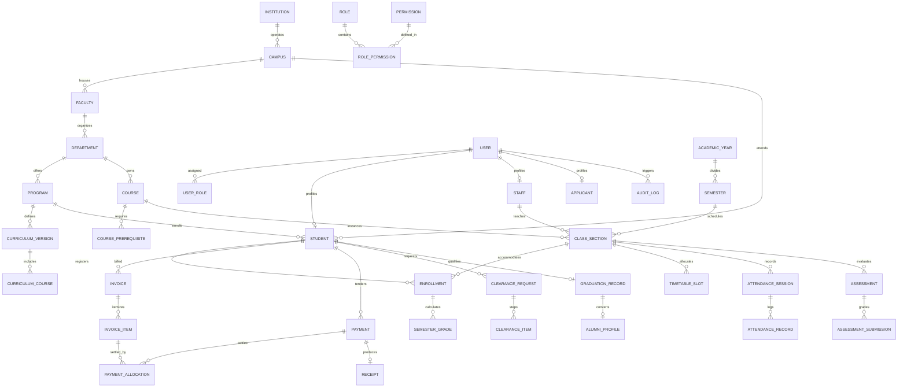

# Database Schema & Entity Relationship Design
## Enterprise College Management System (CMS)

### 1. Database Architecture Principles
- **Relational Normalization**: Strict 3NF compliance across all core institutional tables; controlled denormalization only for pre-computed aggregates (e.g., student balance, cumulative GPA) protected by transactional triggers.
- **Precision Types**:
  - Primary Keys: `UUIDv7` (time-ordered UUIDs for optimal B-Tree index locality and distributed safety).
  - Currency/Money: `NUMERIC(14, 2)` (zero floating-point operations).
  - Timestamps: `TIMESTAMPTZ` (always stored in UTC).
- **Integrity Constraints**: Foreign keys with `ON DELETE RESTRICT` for academic and financial transactions; soft deletion via `deleted_at TIMESTAMPTZ NULL` for archival traceability.
- **Optimistic Concurrency**: `lock_version INTEGER NOT NULL DEFAULT 0` on transactional tables.

---

### 2. High-Level Entity Relationship Diagram (ERD)



---

### 3. Core Database Tables & Data Dictionary

#### A. Institutional & Organizational Hierarchy
1. **`institutions`**: Root institutional configuration, branding, default currency, timezones, accreditation metadata.
2. **`campuses`**: Physical or virtual campuses (`code`, `name`, `address`, `timezone`, `is_active`).
3. **`faculties`**: Schools or faculties (`campus_id`, `code`, `name`, `dean_staff_id`).
4. **`departments`**: Academic departments (`faculty_id`, `code`, `name`, `hod_staff_id`).
5. **`programs`**: Degrees, diplomas, and certificates (`department_id`, `code`, `name`, `degree_level`, `duration_years`, `total_credits_required`).

#### B. Identity & Access Control (RBAC)
6. **`users`**: Central authentication table (`id`, `email`, `username`, `phone`, `password_hash`, `mfa_secret`, `is_mfa_enabled`, `is_active`, `is_locked`, `failed_login_count`, `last_login_at`, `created_at`, `updated_at`, `deleted_at`).
7. **`roles`**: System and custom roles (`id`, `name`, `code`, `description`, `is_system_role`).
8. **`permissions`**: Granular permissions (`id`, `resource`, `action`, `description`).
9. **`role_permissions`**: Pivot linking roles to permitted actions.
10. **`user_roles`**: Pivot assigning users to roles with hierarchical scope (`user_id`, `role_id`, `scope_type`, `scope_id`).
11. **`user_sessions`**: Active device session tracking (`id`, `user_id`, `device_fingerprint`, `ip_address`, `user_agent`, `refresh_token_hash`, `expires_at`, `revoked_at`).

#### C. Academic Structure, Curriculum & Registration
12. **`academic_years`**: e.g., "2026/2027" (`start_date`, `end_date`, `is_current`).
13. **`semesters`**: e.g., "Semester 1", "Semester 2" (`academic_year_id`, `code`, `start_date`, `end_date`, `registration_start`, `registration_end`, `is_closed`).
14. **`courses`**: Course catalog (`code`, `title`, `department_id`, `credit_hours`, `contact_hours`, `is_active`).
15. **`course_prerequisites`**: Prerequisites and co-requisites (`course_id`, `prerequisite_course_id`, `min_grade_required`, `type`).
16. **`curriculum_versions`**: Versioned syllabus structures per program and intake year.
17. **`curriculum_courses`**: Mapping of courses to curriculum versions with year/semester classification (Core vs. Elective).
18. **`class_sections`**: Concrete course offerings per semester (`course_id`, `semester_id`, `campus_id`, `section_name`, `capacity`, `enrolled_count`, `primary_lecturer_id`, `lock_version`).
19. **`enrollments`**: Student course registration records (`student_id`, `class_section_id`, `semester_id`, `status` [PENDING, APPROVED, DROPPED], `registered_at`, `dropped_at`).

#### D. Timetabling & Attendance
20. **`rooms`**: Physical facilities (`campus_id`, `building`, `room_number`, `capacity`, `type` [LECTURE_HALL, LAB, AUDITORIUM]).
21. **`timetable_slots`**: Scheduled session times (`class_section_id`, `room_id`, `day_of_week`, `start_time`, `end_time`, `session_type`).
22. **`attendance_sessions`**: Specific lecture instances (`class_section_id`, `session_date`, `start_time`, `lecturer_id`, `qr_token`, `qr_expires_at`).
23. **`attendance_records`**: Student attendance marks (`attendance_session_id`, `student_id`, `status` [PRESENT, ABSENT, LATE, EXCUSED], `recorded_by`, `verification_method`).

#### E. Assessments, Grading & Progression
24. **`assessments`**: Weighted evaluations (`class_section_id`, `name`, `assessment_type`, `max_marks`, `weight_percentage`, `due_date`).
25. **`assessment_submissions`**: Individual student assessment marks (`assessment_id`, `student_id`, `marks_obtained`, `graded_by`, `feedback`).
26. **`semester_grades`**: Consolidated end-of-term marks (`enrollment_id`, `continuous_assessment_marks`, `exam_marks`, `total_marks`, `letter_grade`, `grade_point`, `workflow_status` [DRAFT, SUBMITTED, MODERATED, APPROVED, PUBLISHED], `lock_version`).
27. **`academic_progression`**: Semester GPA summary (`student_id`, `semester_id`, `sgpa`, `cgpa`, `credits_attempted`, `credits_earned`, `academic_standing`).

#### F. Student Finance & Multi-Channel Payments
28. **`fee_structures`**: Institutional fee templates (`program_id`, `campus_id`, `academic_year_id`, `semester_id`).
29. **`fee_structure_items`**: Line items per fee structure (Tuition, Lab Fee, Technology, Library, Medical).
30. **`invoices`**: Invoiced student receivables (`id`, `invoice_number`, `student_id`, `semester_id`, `total_amount`, `paid_amount`, `balance_amount`, `due_date`, `status` [ISSUED, PARTIALLY_PAID, PAID, CANCELLED], `lock_version`).
31. **`invoice_items`**: Individual billed components (`invoice_id`, `fee_category_id`, `description`, `amount`, `paid_amount`).
32. **`payments`**: Payment transaction master records (`id`, `payment_reference`, `student_id`, `amount`, `currency`, `channel` [MPESA, CARD, BANK_TRANSFER, CASH], `gateway_transaction_id`, `status` [PENDING, SUCCESS, FAILED, REVERSED], `paid_at`, `receipt_number`).
33. **`payment_allocations`**: Settling payments against invoice items (`payment_id`, `invoice_item_id`, `allocated_amount`).
34. **`receipts`**: Official immutable receipt metadata (`receipt_number`, `payment_id`, `issued_at`, `issued_by`, `pdf_url`).
35. **`financial_holds`**: Institutional restriction records (`student_id`, `reason`, `threshold_amount`, `is_active`, `placed_at`, `released_at`).

#### G. Student Services, Clearance, Graduation & Audit
36. **`clearance_requests`**: Student graduation clearance process (`student_id`, `status`, `requested_at`, `final_approved_at`).
37. **`clearance_items`**: Departmental checklist steps (`clearance_request_id`, `department_code` [FINANCE, LIBRARY, HOSTEL, ACADEMIC, SPORTS], `status` [PENDING, APPROVED, REJECTED], `signed_off_by`, `rejection_reason`).
38. **`graduation_records`**: Official graduates registry (`student_id`, `program_id`, `conferral_date`, `certificate_number`, `honors_classification`, `verification_hash`).
39. **`audit_logs`**: Immutable security log (`id`, `user_id`, `action`, `resource`, `resource_id`, `old_values`, `new_values`, `ip_address`, `user_agent`, `created_at`).

---

### 4. Key Indexes & Performance Optimization
```sql
-- Fast student lookup by admission number or user ID
CREATE INDEX idx_students_admission_no ON students(admission_number);
CREATE INDEX idx_students_user_id ON students(user_id);

-- High-speed enrollment queries per semester
CREATE INDEX idx_enrollments_student_semester ON enrollments(student_id, semester_id);
CREATE INDEX idx_enrollments_class_section ON enrollments(class_section_id);

-- Financial queries for aging balances and student ledgers
CREATE INDEX idx_invoices_student_status ON invoices(student_id, status);
CREATE INDEX idx_payments_student_status ON payments(student_id, status);
CREATE UNIQUE INDEX uq_payments_gateway_ref ON payments(gateway_transaction_id) WHERE gateway_transaction_id IS NOT NULL;

-- High-concurrency class section capacity check
CREATE INDEX idx_class_sections_course_semester ON class_sections(course_id, semester_id);

-- Tamper-evident chronological audit indexing
CREATE INDEX idx_audit_logs_resource_id ON audit_logs(resource, resource_id);
CREATE INDEX idx_audit_logs_created_at ON audit_logs(created_at DESC);
```
