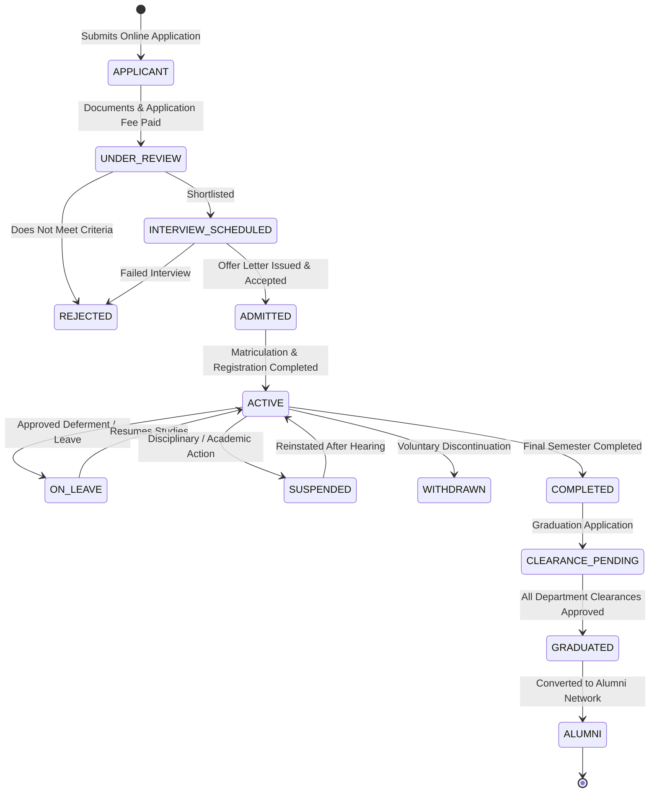
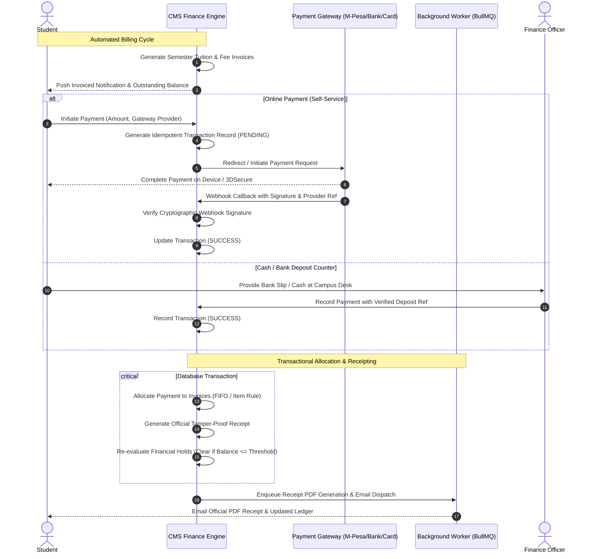
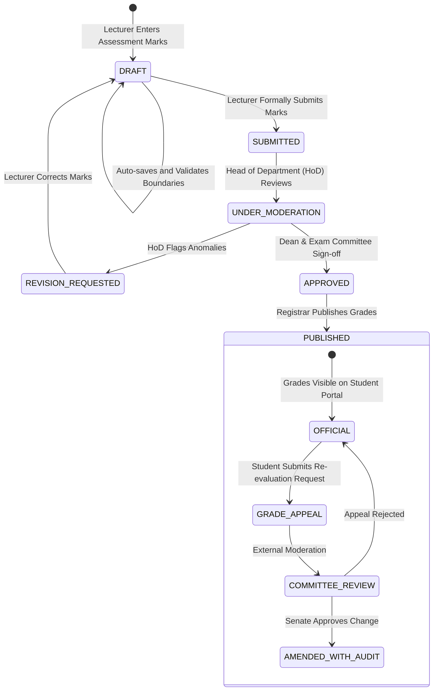
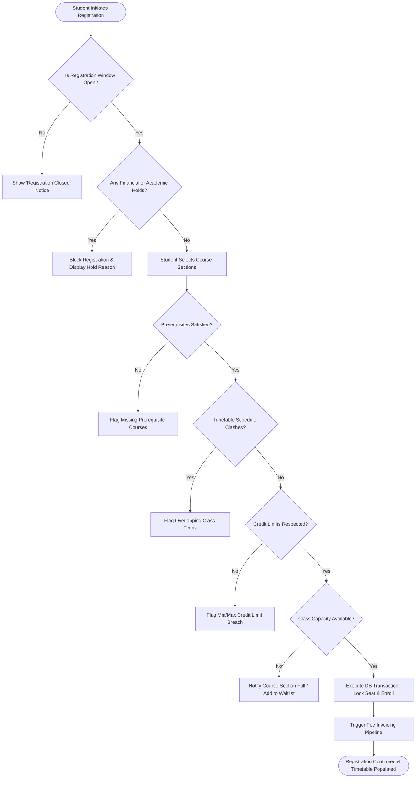
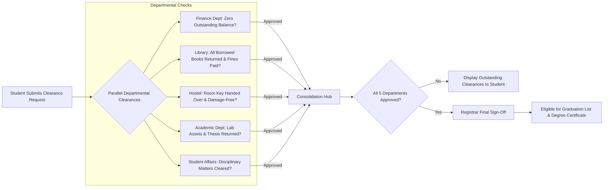

# Major Workflows & State Machines
## Enterprise College Management System (CMS)

### 1. Unified Student Lifecycle Workflow

---

### 2. Financial Billing, Payment & Allocation Workflow

---

### 3. Academic Grading & Publishing State Machine

---

### 4. Course Registration Engine Workflow

---

### 5. Multi-Department Clearance Workflow

